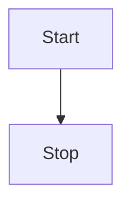

# Overview

As Google Analytics phases out Universal Analytics we have switched to a custom built platform that can handle event tracking from all of our apps.

As of right now the new analytics system exposes a REST api endpoint that can be used to send data to. It only accepts data for storage and cannot be used to retreive data from the database.

## Tech stack

- Hosting platform: Vercel (AWS)

- API: Vercel edge functions 

- Database: MongoDB

- Frontend: NextJS

:::warning
The Vercel edge functions are currently being used since it ties in very will with NextJS and the Vercel platform. However, this is something that is not set in stone and can be moved to it's own standalone platform if necessary.
:::

