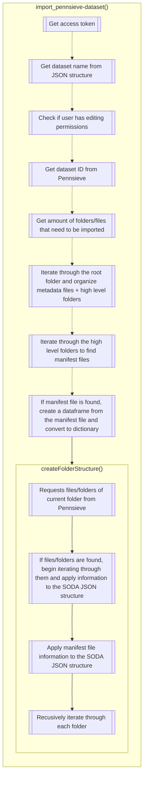

# Overview

The page outlines how the import function works for Pennsieve datasets. It describes the backend process of using the Pennsieve API to fetch a dataset and import it into SODA for SPARC.

## Import Pennsieve dataset

The import Pennsieve dataset function is the process of importing a Pennsieve dataset into SODA for SPARC. The process is initiated by the client. The client sends
request to the server to import. The server then goes through a series of steps to place all files/folders in the SODA JSON Structure.

