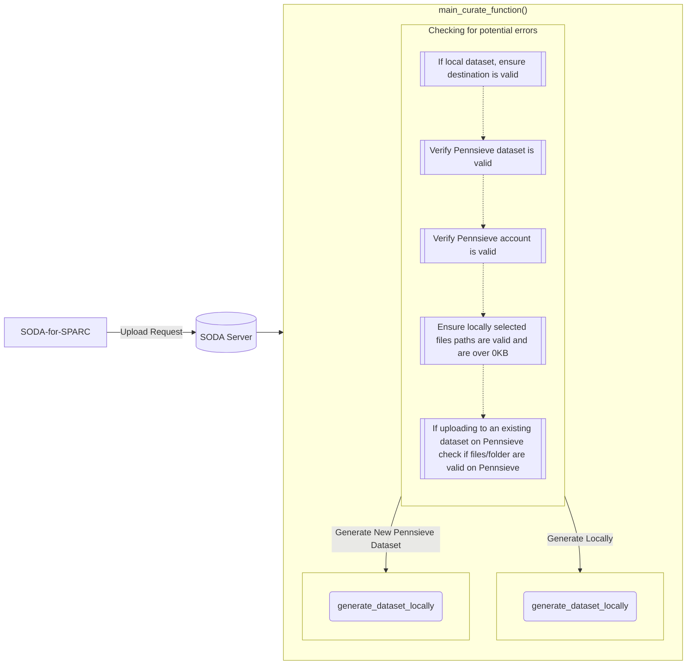

# Overview

This page outlines the major functions in SODA for SPARC. It describes the upload and import processes. It also describes the process of creating a new dataset and uploading data to it. To aid in understanding key concepts links to the flask_restx documentation are included.

## Upload Process

The upload process is the process of uploading data to a Pennsieve dataset. The process is initiated by the client. The client sends a request to the server to upload data to a Pennsieve dataset. The server then sends a request to the Pennsieve Agent to upload the data. The Agent then uploads the data to the Pennsieve dataset. The server then sends a request to the Pennsieve service to import the data. The Pennsieve service then imports the data into the Pennsieve dataset.

