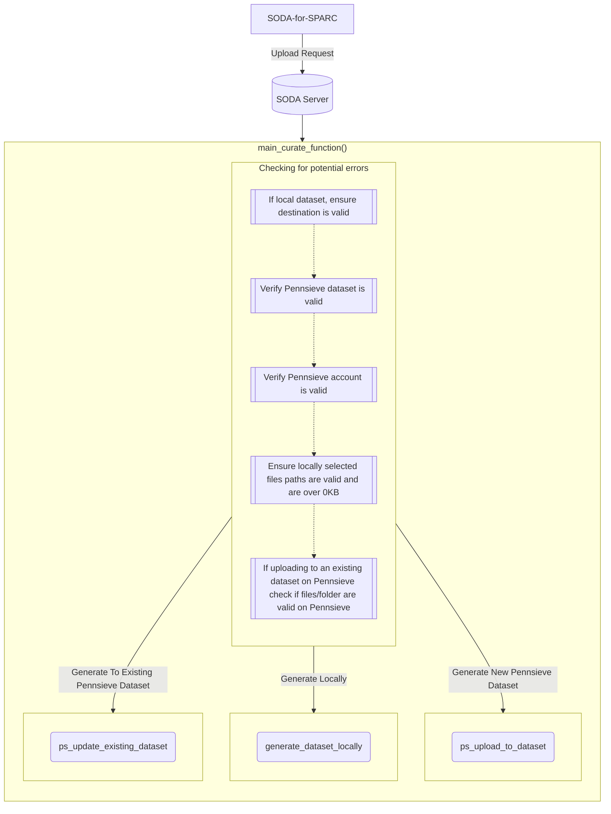
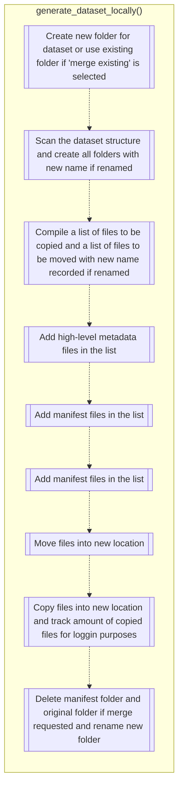
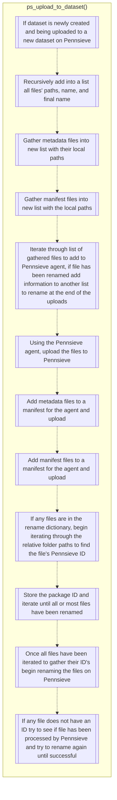
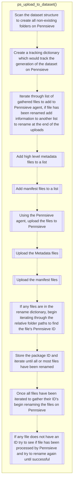
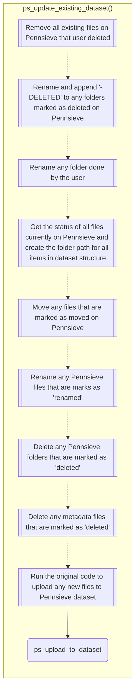

# Overview

This page outlines the major functions in SODA for SPARC. It describes the upload and import processes. It also describes the process of creating a new dataset and uploading data to it. To aid in understanding key concepts links to the flask_restx documentation are included.

## Main upload process

The main upload process goes through a series of checks to ensure that the upload process will be successful. When uploading to Pennsieve a valid Pennsieve dataset and account is needed to begin. Local files/folders that will be uploaded are also validated
to ensure the paths are correct.
The process is initiated by the client. The client sends a request to the SODA server to upload data to a Pennsieve dataset.
The upload process is the process of uploading data to a Pennsieve dataset. The process is initiated by the client. The client sends a request to the server to upload data to a Pennsieve dataset. The server then sends a request to the Pennsieve Agent to
upload the data. The Agent then uploads the data to the Pennsieve dataset. The server then sends a request to the Pennsieve service to import the data. The Pennsieve service then imports the data into the Pennsieve dataset.

## Generate Dataset Locally

When generating datasets locally, the server will gather all files/folders and create them in the SDS 2.0 format. The server will then create a dataset on the user's local machine.

## Generate New Dataset To Pennsieve

When generating new datasets to Pennsieve there are less pre-checks than
when uploading to an existing dataset. The server will still check if the
Pennsieve account and dataset are valid. Depending if the dataset is newly
created on SODA and is being uploaded to a new or existing dataset will determine
the level of checks needed.
The server will recursively create the folders on Pennsieve before
uploading to files to the dataset if you are uploading to an existing dataset
even when uploading a newly created dataset. This ensures that
existing files/folders are handled properly for renaming, moving and deleting.
The server will then make a list of the files that will be uploaded to Pennsieve
and send it to the Pennsieve Agent. When a dataset is newly created on SODA
and being uploaded to a new Pennsieve dataset the folders will be created by the
agent.
The Agent will create a manifest of all the files that will be uploaded
to Pennsieve. We add a subscriber to the upload process to track the progress
of the upload. This process will happen again for metadata files and manifest files.
Three manifest files will be created for the Pennsieve agent to upload the dataset.
During this process, if files that need to be renamed are detected, the SODA server
will create a dictionary of the files that need to be renamed and the new name. The
relative path will be the parent key of these files. Once the upload is completed,
the server will iterate through the relative paths to find the Pennsieve ID of the
files that need to be renamed. At times not all files will have been processed
by Pennsieve so the server will poll the relative path until necessary
information is given to rename the files. Once all files have been renamed
the upload is complete.

### New SODA Dataset to New Pennsieve Dataset

### New SODA Dataset to Existing Pennsieve Dataset

## Generate Dataset To Existing Pennsieve Dataset

When generating datasets to an existing Pennsieve dataset there are a few
more pre-checks than when uploading to a new Pennsieve dataset.
The server will still check if the Pennsieve account and dataset are valid but also
determine if any existing files/folders have been marked as deleted, moved
or renamed. Once files/folders that already exist on Pennsieve have been accounted
the function ps_upload_to_dataset() will run, which will upload all newly
added files.

