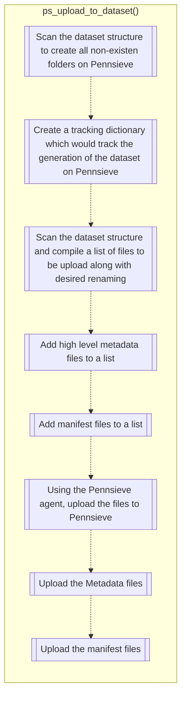
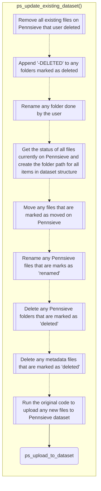

# Overview

This page outlines the major functions in SODA for SPARC. It describes the upload and import processes. It also describes the process of creating a new dataset and uploading data to it. To aid in understanding key concepts links to the flask_restx documentation are included.

## Main upload process

The main upload process goes through a series of checks to ensure that the upload process will be successful. When uploading to Pennsieve a valid Pennsieve dataset and account is needed to begin. Local files/folders that will be uploaded are also validated
to ensure the paths are correct.
The process is initiated by the client. The client sends a request to the SODA server to upload data to a Pennsieve dataset.
The upload process is the process of uploading data to a Pennsieve dataset. The process is initiated by the client. The client sends a request to the server to upload data to a Pennsieve dataset. The server then sends a request to the Pennsieve Agent to
upload the data. The Agent then uploads the data to the Pennsieve dataset. The server then sends a request to the Pennsieve service to import the data. The Pennsieve service then imports the data into the Pennsieve dataset.

## Generate Dataset Locally

When generating datasets locally, the server will gather all files/folders and create them in the SDS 2.0 format. The server will then create a dataset on the user's local machine.

## Generate New Dataset To Pennsieve

When generating new datasets to Pennsieve there are less pre-checks than when uploading to an existing dataset. The server will still check if the Pennsieve account and dataset are valid. The server will then recursively create the folders on Pennsieve before
uploading to files to the dataset. The server will then make a list of the files that will be uploaded to Pennsieve and send it to the Pennsieve Agent. The Agent will create a manifest of all the files that will be uploaded to Pennsieve. We add a subscriber to
the upload process to track the progress of the upload.

## Generate Dataset To Existing Pennsieve Dataset

When generating datasets to an existing Pennsieve dataset there are more pre-checks than when uploading to a new Pennsieve dataset. The server will still check if the Pennsieve account and dataset are valid. The server will then recursively create the folders on Pennsieve before

